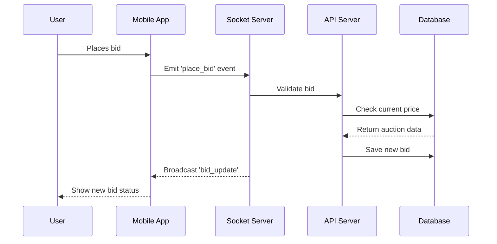

# Car Auction Application

## Project Overview
This is a real-time car auction platform that allows users to participate in car auctions, place bids, and manage their auction activities. The application is built using modern web technologies and follows a client-server architecture.

## Technology Stack

### Frontend
- **React Native**: A framework for building native mobile applications using React
- **Socket.io Client**: For real-time bidding and auction updates
- **Navigation**: React Navigation for handling screen transitions and routing
- Components:
  - Authentication screens (Login/Register)
  - Car listing and detail views
  - Bidding interface
  - Profile management
  - Auction history tracking

### Backend
- **Node.js**: Runtime environment for the server
- **Express.js**: Web application framework
- **MongoDB**: Database for storing user data, car information, and auction details
- **Socket.io**: For real-time communication
- **JWT**: For secure authentication

## Key Features
1. **User Authentication**
   - Registration and login system
   - Secure password handling
   - JWT token-based authentication

2. **Car Auctions**
   - Real-time bidding system
   - Automatic auction status updates
   - Detailed car information display
   - Image handling for car photos

3. **User Profile**
   - Track participation in auctions
   - View won and lost auctions
   - Manage personal information
   - Bid history

4. **Real-time Features**
   - Live bid updates
   - Auction countdown timers
   - Instant notifications for outbids
   - Live auction status changes

## Project Structure

```
CarAuctionApp/
├── frontend/
│   ├── src/
│   │   ├── screens/          # Main application screens
│   │   │   ├── AuthenticationScreens.js
│   │   │   ├── CarListingScreen.js
│   │   │   ├── CarDetailScreen.js
│   │   │   ├── BiddingScreen.js
│   │   │   ├── ProfileScreen.js
│   │   │   └── AuctionHistoryScreen.js
│   │   │
│   │   ├── components/       # Reusable UI components
│   │   │   ├── CustomButton.js
│   │   │   ├── CustomInput.js
│   │   │   ├── CustomText.js
│   │   │   └── CustomImage.js
│   │   │
│   │   ├── navigation/       # Navigation configuration
│   │   │   ├── AppNavigator.js
│   │   │   └── AppRoutes.js
│   │   │
│   │   ├── services/         # API and Socket.io services
│   │   │   ├── AuthService.js
│   │   │   ├── CarService.js
│   │   │   ├── AuctionService.js
│   │   │   └── SocketService.js
│   │   │
│   │   └── utils/           # Helper functions and constants
│   │       └── Constants.js
│   │
│   └── assets/              # Images and static resources
│
├── backend/
│   ├── models/              # Database models
│   │   ├── User.js
│   │   ├── Car.js
│   │   ├── Auction.js
│   │   └── Bid.js
│   │
│   ├── routes/              # API endpoints
│   │   ├── authRoutes.js
│   │   ├── carRoutes.js
│   │   ├── auctionRoutes.js
│   │   └── userRoutes.js
│   │
│   ├── controllers/         # Business logic
│   │   ├── AuthController.js
│   │   ├── CarController.js
│   │   ├── AuctionController.js
│   │   └── UserController.js
│   │
│   ├── middleware/          # Authentication and validation
│   │   ├── authMiddleware.js
│   │   └── validationMiddleware.js
│   │
│   └── config/             # Configuration files
│       ├── config.js
│       └── db.js
│
└── documentation/          # Project documentation and LaTeX reports
```

## How It Works

### Authentication Flow
1. User registers with email and password
2. Credentials are securely stored in MongoDB
3. Upon login, user receives JWT token
4. Token is used for all subsequent API requests

### Auction Process
1. Admin creates auction with car details and starting price
2. Users can view active auctions
3. Authenticated users can place bids
4. Real-time updates are sent to all participants
5. When auction ends, winner is automatically determined

### Real-time Communication
- Socket.io maintains WebSocket connections
- Server broadcasts bid updates to all connected clients
- Clients receive instant notifications for relevant events
- Automatic status updates when auctions end

## Getting Started

### Prerequisites
- Node.js (v14 or higher)
- MongoDB
- React Native development environment
- Android Studio or Xcode (for mobile development)

### Installation Steps
1. Clone the repository
2. Install backend dependencies:
   ```bash
   cd backend
   npm install
   ```
3. Install frontend dependencies:
   ```bash
   cd frontend
   npm install
   ```
4. Configure environment variables
5. Start the backend server:
   ```bash
   npm start
   ```
6. Run the mobile application:
   ```bash
   npx react-native run-android
   # or
   npx react-native run-ios
   ```

## Security Features
- Encrypted password storage
- JWT token authentication
- Protected API endpoints
- Input validation and sanitization
- Secure WebSocket connections

## Future Enhancements
- Payment gateway integration
- Advanced search filters
- User ratings system
- Multiple image support for cars
- Chat system between buyers and sellers

## Documentation
Detailed documentation is available in LaTeX format, covering:
- System architecture
- User guides
- API documentation
- Database schema
- Deployment guides

For more detailed information, please refer to the LaTeX documentation in the `documentation` folder.

## Component Interactions

### Bidding Flow Example


### Data Flow Examples

1. **Car Listing Flow**:
   ```javascript
   // CarListingScreen.js
   const fetchCars = async () => {
     const cars = await CarService.getAllCars();
     setCars(cars);
   };

   // CarService.js
   const getAllCars = async () => {
     const response = await axios.get(`${API_URL}/cars`);
     return response.data;
   };

   // Backend: carRoutes.js
   router.get('/cars', authMiddleware, CarController.getAllCars);
   ```

2. **Real-time Auction Updates**:
   ```javascript
   // Frontend: AuctionService.js
   socket.on('auction_update', (data) => {
     updateAuctionState(data);
     showNotification(data.message);
   });

   // Backend: Socket Handler
   io.on('connection', (socket) => {
     socket.on('join_auction', (auctionId) => {
       socket.join(`auction_${auctionId}`);
     });
   });
   ```

## Detailed Technology Breakdown

### React Native Architecture
- **Navigation Stack**:
  ```javascript
  const Stack = createStackNavigator();
  
  function AppNavigator() {
    return (
      <Stack.Navigator>
        <Stack.Screen name="Home" component={HomeScreen} />
        <Stack.Screen name="CarDetail" component={CarDetailScreen} />
        <Stack.Screen name="Bidding" component={BiddingScreen} />
      </Stack.Navigator>
    );
  }
  ```

### MongoDB Schema Examples
```javascript
// User Model
const userSchema = new Schema({
  email: { type: String, required: true, unique: true },
  password: { type: String, required: true },
  bids: [{ type: Schema.Types.ObjectId, ref: 'Bid' }],
  wonAuctions: [{ type: Schema.Types.ObjectId, ref: 'Auction' }]
});

// Auction Model
const auctionSchema = new Schema({
  car: { type: Schema.Types.ObjectId, ref: 'Car' },
  startPrice: { type: Number, required: true },
  currentPrice: { type: Number, required: true },
  endTime: { type: Date, required: true },
  status: { type: String, enum: ['active', 'ended', 'cancelled'] }
});
```

### Socket.IO Event System
```javascript
// Backend Events
const auctionEvents = {
  BID_PLACED: 'bid_placed',
  AUCTION_ENDED: 'auction_ended',
  OUTBID_NOTIFICATION: 'outbid_notification'
};

// Frontend Socket Handler
useEffect(() => {
  socket.on(auctionEvents.BID_PLACED, handleNewBid);
  socket.on(auctionEvents.AUCTION_ENDED, handleAuctionEnd);
  socket.on(auctionEvents.OUTBID_NOTIFICATION, handleOutbid);
  
  return () => {
    socket.off(auctionEvents.BID_PLACED);
    socket.off(auctionEvents.AUCTION_ENDED);
    socket.off(auctionEvents.OUTBID_NOTIFICATION);
  };
}, []);
```

## Troubleshooting Guide

### Common Issues and Solutions

1. **Authentication Issues**
   - Error: "Invalid token"
     ```bash
     # Check token expiration
     jwt.verify(token, SECRET_KEY, (err, decoded) => {
       if (err) console.log('Token error:', err.message);
     });
     ```
   - Solution: Clear local storage and re-login

2. **Real-time Updates Not Working**
   - Check Socket Connection:
     ```javascript
     socket.on('connect_error', (error) => {
       console.log('Socket connection error:', error);
     });
     ```
   - Ensure proper event names are used
   - Verify WebSocket server is running

3. **Mobile App Build Errors**
   - iOS:
     ```bash
     cd ios
     pod deintegrate
     pod install
     ```
   - Android:
     ```bash
     cd android
     ./gradlew clean
     ```

4. **Database Connection Issues**
   ```bash
   # Check MongoDB connection
   mongo --eval "db.adminCommand('ping')"
   
   # Verify connection string
   echo $MONGODB_URI
   ```

5. **Image Upload Problems**
   - Verify file size limits
   - Check storage permissions
   - Ensure proper MIME types

### Performance Optimization Tips

1. **React Native**
   - Use `useMemo` for expensive calculations
   - Implement `FlatList` for long lists
   - Optimize image sizes

2. **Backend**
   - Implement database indexing
   - Use caching for frequent queries
   - Optimize API response payload

3. **Socket.IO**
   - Use room-based broadcasting
   - Implement reconnection logic
   - Handle connection timeouts

## Development Best Practices

1. **Code Organization**
   - Follow feature-based structure
   - Implement proper error handling
   - Use TypeScript for better type safety

2. **Testing**
   ```bash
   # Run backend tests
   npm run test:backend
   
   # Run frontend tests
   npm run test:frontend
   ```

3. **Deployment Checklist**
   - Environment variables configured
   - Database backups set up
   - SSL certificates installed
   - Monitoring tools integrated
